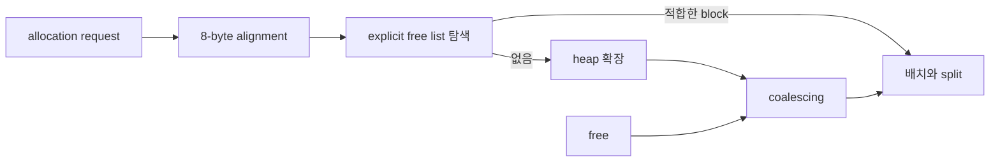

# MemoryAllocator

`malloc`, `free`, `realloc`의 핵심 동작을 C로 구현한 동적 메모리 할당기입니다. boundary tag와 explicit free list를 이용해 빈 block을 재사용하고 인접한 공간을 합칩니다.

## 시작한 이유

동적 할당을 library 호출로만 사용하지 않고 heap block이 어떻게 나뉘고 다시 합쳐지는지 이해하려고 시작했습니다. 크래프톤 정글 Malloc Lab trace를 실행하며 공간 활용률과 처리량을 함께 비교했습니다.

## 구현 범위

| 영역 | 구현 |
| --- | --- |
| Block metadata | header와 footer에 size와 allocation bit 저장 |
| Free list | payload 안의 predecessor와 successor pointer |
| Allocation | first fit과 최소 block 크기 기반 split |
| Free | 네 가지 인접 상태를 처리하는 coalescing |
| Realloc | 다음 block, 이전 block, 새 block 순서로 확장 시도 |
| Heap growth | 4KB chunk 단위 확장 |

## 아키텍처와 코드 구조



```text
allocated block
[ header | payload | footer ]

free block
[ header | predecessor | successor | free space | footer ]
```

핵심 구현은 `malloc-lab/mm.c`에 있습니다. `mdriver`는 trace별 correctness, utilization, throughput을 측정합니다.

## 문제 해결 과정

### 64-bit pointer가 겹치지 않는 최소 block 크기

header와 footer는 4 byte지만 free list pointer는 64-bit 환경에서 8 byte입니다. successor 위치를 word size만큼 이동하면 predecessor와 memory가 겹쳐 list가 깨졌습니다.

pointer 간격은 `sizeof(void *)`로 계산하고, free block의 최소 크기는 header, footer, 두 pointer가 모두 들어가는 24 byte로 정했습니다. split 뒤 남는 공간도 이 크기 이상일 때만 새 free block으로 만듭니다.

### coalescing과 free list 연결을 함께 갱신

인접 block을 합치면서 기존 node를 list에 남겨 두면 같은 memory가 여러 번 탐색됩니다. 이전과 다음 block의 allocation 상태를 네 가지 경우로 나누고, 합칠 이웃을 list에서 먼저 제거했습니다.

새 header와 footer를 기록한 뒤 합쳐진 block 하나만 list 앞에 다시 넣어 heap 구조와 free list가 같은 상태를 가리키게 했습니다.

### realloc에서 가능한 한 기존 pointer 유지

항상 새 block을 할당해 복사하면 큰 payload에서 비용이 커집니다. 현재 block 뒤가 비어 있고 필요한 크기를 만족하면 다음 block을 흡수해 pointer를 유지했습니다.

앞 block까지 사용해야 할 때는 free list에서 먼저 제거한 뒤 `memmove`로 payload를 옮겼습니다. pointer metadata를 덮어쓴 뒤 list에서 제거하면 손상된 주소를 읽게 되므로 순서를 분리했습니다.

### split 뒤 남은 공간의 재사용

요청보다 큰 free block을 전부 할당하면 외부 단편화는 줄어도 내부 낭비가 커집니다. 남은 공간이 최소 free block 크기 이상일 때만 block을 나누고, 나머지를 즉시 free list에 연결했습니다.

## 실행 방법

GCC와 Make가 있는 Linux 환경에서 실행합니다.

```bash
cd malloc-lab
make clean
make
./mdriver -V
```

VS Code DevContainer를 열면 같은 compiler와 debugger 설정을 사용할 수 있습니다.

## 테스트

2026년 8월 24일 Docker `gcc:14`에서 기본 trace 11개를 실행했습니다.

| 항목 | 결과 |
| --- | ---: |
| correctness | 11개 trace 모두 valid |
| 평균 utilization | 72% |
| 처리량 | 4,906 Kops |
| performance index | 83/100 |

## 남은 과제

- 사용하지 않는 next fit과 best fit 구현 정리 또는 전략 비교 연결
- heap invariant를 검사하는 `mm_checkheap` 추가
- size class별 segregated free list와 현재 first fit 비교

## 관련 프로젝트

- [CDataStructures](https://github.com/NearthYou/CDataStructures): linked list와 tree pointer 연산 연습
- [TinyWebServer](https://github.com/NearthYou/TinyWebServer): C socket과 process 기반 web server
